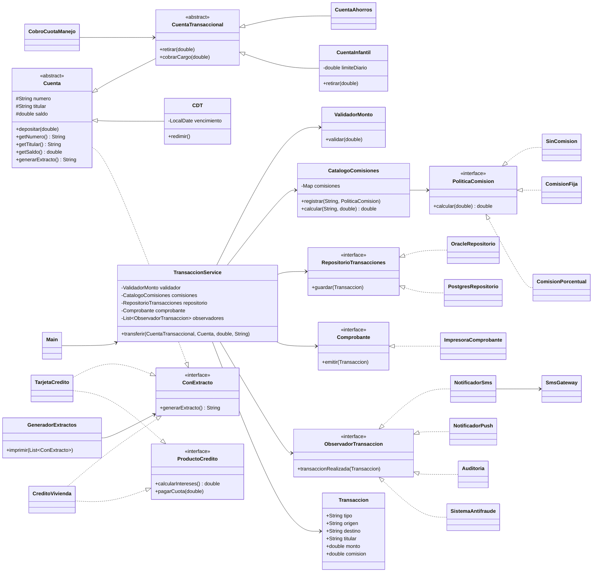

# Laboratorio L2 — SOLID: el backend de Banco Andino

Ingeniería de Software II · Universidad Nacional de Colombia · 2026-2

**Lenguaje elegido:** Java 21 (el mismo del código base, para no introducir ruido al traducir).
**Pruebas:** JUnit 4.13.2 (los `.jar` están en `lib/`, así el repo compila sin Maven ni Gradle).

## Cómo ejecutar

```bash
./run.sh            # compila y ejecuta Main
./check.sh          # prueba de caracterización: compara contra salida_original.txt
./test.sh           # pruebas unitarias (desde el bloque 3)
```

## Bloque 0 — Arranque

Copiamos el código base sin cambiar nada (solo cambiamos las comillas tipográficas `’` del
`INSERT` de `OracleRepositorio` por comillas simples normales, porque así venían en el PDF).
La salida quedó guardada en `salida_original.txt`.

Lo primero que notamos leyendo el flujo de una transferencia: `transferir` hace **todo** —
valida, calcula comisión, mueve plata, guarda, imprime, manda SMS y audita— en un solo
método. Y el CDT de Ana se crea en `Main` pero nunca se usa (sospechoso…).

Como el PDF sugiere `diff`, escribimos `check.sh`, que hace el diff pero reemplaza la
fecha/hora de la auditoría por `<FECHA>`, para que el diff solo falle si cambió algo de verdad.

## Bloque 1 — Diagnóstico

### 1.1 Tabla de hallazgos

| # | Clase / método | Letra | Evidencia en el código | Consecuencia para el banco o el cliente |
|---|---|---|---|---|
| 1 | `TransaccionService.transferir` | **S** | Un solo método de 36 líneas con 7 bloques comentados: validación, comisión, movimiento de dinero, persistencia, comprobante, SMS y auditoría. | Si legal pide cambiar el texto del comprobante, o marketing el texto del SMS, hay que tocar el mismo método que mueve la plata. Un error de tipeo ahí puede cobrar mal una transferencia o dejar de guardarla. Además varias personas no pueden trabajar a la vez en esa clase sin pisarse. |
| 2 | `CobroCuotaManejo.cobrarMensual` | **S** | Cobra la cuota y además decide cómo se informa el cobro (`System.out.println`). | Si el reporte del cobro tiene que ir a un archivo o a otra parte hay que tocar la lógica del cobro. |
| 3 | `TransaccionService.transferir` (`switch (tipo)`) | **O** | Cada tipo de transferencia es un `case` con un `String`. | Agregar un tipo (p. ej. transferencias por llave) obliga a abrir y editar la clase más delicada del sistema y volver a probar todas las transferencias que ya funcionaban. Si alguien escribe `"OTRO BANCO"` en vez de `"OTRO_BANCO"` el error solo aparece en ejecución. |
| 4 | `TransaccionService.transferir` (notificación y auditoría fijas) | **O** | El SMS y la auditoría están escritos "a mano" dentro del método. | Si llega un canal nuevo (push, correo) o un sistema nuevo que necesite enterarse de cada transacción, hay que editar el método otra vez. |
| 5 | `CDT extends Cuenta`, `CDT.retirar` | **L** | `CDT` hereda `retirar` pero lo sobrescribe para lanzar `UnsupportedOperationException` antes del vencimiento. Un `CDT` no se puede usar en todos los lugares donde se espera una `Cuenta`. | Cualquier código que reciba una `Cuenta` (cobro de cuota, transferencias) puede explotar en ejecución. Ver experimento 1: el proceso nocturno de cobro se cae a la mitad. |
| 6 | `TransaccionService.transferir` con `CDT` como origen | **L** | El tipo `Cuenta` del parámetro deja pasar un `CDT`. | Una transferencia desde un CDT compila perfecto y solo falla en producción, frente al cliente. |
| 7 | `TarjetaCredito.depositar`, `CreditoVivienda.depositar`, `CreditoVivienda.retirar` | **L** | Métodos vacíos con comentario `// no aplica`: no hacen nada **y no avisan**. | Si un desarrollador (o un cajero de la app) llama `depositar` sobre el crédito de vivienda creyendo que está abonando, el dinero "se consigna" y desaparece sin error. Es peor que lanzar excepción porque nadie se entera. |
| 8 | `ProductoBancario` | **I** | Interfaz con 5 métodos que mezcla cosas de cuentas (depositar/retirar) con cosas de crédito (intereses, pagar cuota) y de reporte (extracto). | Tarjeta y crédito están obligados a implementar operaciones que no tienen. El generador de extractos solo necesita `generarExtracto()`, pero depende de toda la interfaz: si cambia la firma de `pagarCuota`, se recompila el generador de extractos sin razón. |
| 9 | `TransaccionService` (`new OracleRepositorio()`, `new SmsGateway()`) | **D** | La lógica de negocio crea directamente las clases concretas de infraestructura. | No se puede cambiar Oracle por otra base de datos (o por un doble de prueba) sin editar la clase. Toda prueba de `transferir` escribe en la base de producción y le manda un SMS real a un cliente (experimento 2). |
| 10 | `CobroCuotaManejo` → `Cuenta` concreta | **D** | Depende de la clase concreta `Cuenta` con todo su comportamiento, cuando solo necesita "algo a lo que se le pueda cobrar". | Por eso termina aceptando un CDT (está muy relacionado con el hallazgo 5). |

**Otras cosas que vimos y que no son exactamente de SOLID** (las anotamos, pero no las
corregimos, porque la regla 3 dice que el comportamiento no puede cambiar):

- `Cuenta.retirar` no valida que el monto sea positivo: `retirar(-100_000)` **aumenta** el saldo.
- El mensaje dice "Supera el tope diario" pero el código compara contra el monto de **una**
  transferencia, no contra lo acumulado en el día. O el mensaje está mal o el control está mal.
- Se usa `double` para dinero (por eso el extracto imprime `$1.2E8`). En un banco real
  debería ser `BigDecimal` o centavos en `long`.
- `TarjetaCredito.pagarCuota` permite pagar más de la deuda y dejarla negativa.
- Si `destino.depositar` fallara después de `origen.retirar`, la plata ya salió del origen y no
  hay rollback. No es un problema de SOLID, es de transaccionalidad.

### 1.2 Experimentos

**Experimento 1 — el CDT.** No quisimos editar `Main` y arriesgarnos a dejar el cambio en el
commit, así que lo hicimos en `experimentos/ExperimentoCDT.java`: cobramos la cuota a
`[ana, cdtAna, luis, pedro]`. Salida (`experimentos/salida_experimento_cdt.txt`):

```
Cuota de manejo cobrada a 001-1
Exception in thread "main" java.lang.UnsupportedOperationException: Un CDT no permite retiros antes del vencimiento
	at CDT.retirar(CDT.java:14)
	at CobroCuotaManejo.cobrarMensual(CobroCuotaManejo.java:8)
```

A Ana se le cobra, el programa explota en el CDT y **a Luis y a Pedro nunca se les cobra**.
En producción, con un millón de cuentas y el CDT en la posición 500 000: las primeras 499 999
cuentas quedan cobradas, las otras 500 000 no, y el proceso termina con error. A la mañana
siguiente alguien tiene que averiguar hasta dónde llegó, y si simplemente lo vuelve a correr
**les cobra doble a las primeras 499 999** (no hay forma de saber cuáles ya se cobraron, porque
el cobro ni siquiera se guarda). Además el banco deja de recibir la mitad del ingreso por
cuotas ese mes.

**Experimento 2 — la prueba imposible.** Escribimos `experimentos/PruebaImposibleTest.java`
(JUnit). La prueba técnicamente "pasa", pero mirando la salida
(`experimentos/salida_prueba_imposible.txt`):

```
[ORACLE] Conectando a jdbc:oracle:thin:@prod-db:1521/BANCO...
[ORACLE] INSERT INTO transacciones VALUES ('T-1', 'T-2', 100000.0, 7500.0)
...
[SMS] Para Prueba: Transferiste $100000.0 a la cuenta T-2
```

O sea, **no cumplimos la condición**: insertamos una transacción falsa en la base de
producción y mandamos un SMS. No lo logramos porque `TransaccionService` crea
`OracleRepositorio` y `SmsGateway` con `new` dentro de la clase, así que no hay por dónde
meterle una versión falsa. Tampoco hay un método que devuelva la comisión: la tuvimos que
deducir del saldo final, o sea que la prueba depende de que el movimiento de dinero también
funcione (no prueba una sola cosa).

(Pensamos en heredar de `TransaccionService` para sobrescribir… pero los campos son
`private final` y se inicializan en la declaración, así que tampoco.)

### 1.3 Medición "antes"

| Métrica | Antes |
|---|---|
| Líneas del método `transferir` | 36 (desde la firma hasta la llave de cierre) |
| Razones distintas por las que `TransaccionService` podría cambiar | 7 (reglas de validación/tope, tarifas de comisión, forma de mover el dinero, base de datos, formato del comprobante, canal de notificación, auditoría) |
| Clases concretas que `TransaccionService` crea con `new` | 2 (`OracleRepositorio`, `SmsGateway`) |
| Métodos vacíos o que lanzan excepción por "no aplica" | 4 (`TarjetaCredito.depositar`, `CreditoVivienda.depositar`, `CreditoVivienda.retirar`, `CDT.retirar`) |
| ¿Se puede probar `transferir` sin Oracle ni SMS? | No |

Sobre `CDT.retirar`: dudamos si contarlo porque sí retira después del vencimiento. Lo contamos
porque durante toda la vida útil del CDT lanza "no aplica", que es justo el problema.

### 1.4 Diagrama de clases del código original

Ver [`docs/uml-antes.md`](docs/uml-antes.md).

## Bloque 2 — Refactorización

En cada punto de control corrimos `./check.sh` (diff contra `salida_original.txt` ignorando la
fecha de auditoría) antes de hacer el commit. Los cinco dieron `OK: el comportamiento no cambió`.

### Punto de control S

Partimos `transferir` en una clase por responsabilidad:

| Responsabilidad original (comentario del código) | Ahora vive en |
|---|---|
| 1. Validación | `ValidadorMonto` |
| 2. Cálculo de la comisión | `CalculadoraComision` (el `switch` se mudó aquí tal cual; lo arreglamos en O) |
| 3. Movimiento del dinero | se queda en `TransaccionService` (es justo lo que coordina) |
| 4. Persistencia | `OracleRepositorio` (ya existía) |
| 5. Comprobante | `ImpresoraComprobante` |
| 6. Notificación | `NotificadorSms` (arma el texto) + `SmsGateway` (lo envía) |
| 7. Auditoría | `Auditoria` |

También creamos el record `Transaccion` para no pasar `origen, destino, monto, comision, tipo,
titular` sueltos a todas las clases.

A propósito **todavía** dejamos los `new` dentro de `TransaccionService`: queríamos un commit
que solo separara responsabilidades, para que el diff se pudiera leer. Eso es D.

**Pregunta de control.** *¿Qué hace `TransaccionService`, en una frase?* "Coordina los pasos de
una transferencia." Al principio escribimos "valida, cobra la comisión, mueve el dinero **y**
avisa…" y nos dimos cuenta de que estábamos describiendo lo que hacen las otras clases; lo
que hace ella es el orden. Nos quedó la duda de si "mover el dinero" (`origen.retirar` +
`destino.depositar`) es otra responsabilidad: decidimos que no, porque son dos líneas que *son*
la transferencia, y sacarlas a otra clase dejaría a `TransaccionService` vacía.

*Si legal pide cambiar el formato del comprobante, ¿qué archivo tocan?* Solo
`ImpresoraComprobante.java`.

### Punto de control O

Reemplazamos el `switch` por la interfaz `PoliticaComision` con tres implementaciones
(`SinComision`, `ComisionFija`, `ComisionPorcentual`) y un `CatalogoComisiones` que relaciona el
nombre del tipo (`"OTRO_BANCO"`) con su política. El catálogo se arma en `Main` y se le pasa a
`TransaccionService` por el constructor.

Primero pensamos en hacer una clase por tipo (`ComisionOtroBanco`, `ComisionInternacional`…),
pero vimos que `OTRO_BANCO` es simplemente "una tarifa fija de 7.500", así que preferimos
clases por **forma de cobrar** con el valor como parámetro. Así, si el banco sube la tarifa,
se cambia un número en `Main`, no una clase.

Algo que no esperábamos: para que agregar un tipo nuevo solo toque `Main`, el catálogo tenía
que venir de afuera. O sea que en este punto ya tuvimos que inyectar una dependencia por
constructor (adelantándonos un poco a D). Las demás las dejamos con `new` hasta D.

Mantuvimos el tipo como `String` (y no un `enum`) porque un `enum` volvería a obligar a editar
un archivo existente cada vez que llega un tipo. El costo es que un tipo mal escrito solo se
detecta en ejecución ("Tipo de transferencia desconocido"), igual que antes.

**Pregunta de control.** *Si mañana llega un tipo nuevo, ¿qué archivos existentes hay que
modificar?*

- Si su comisión es de una forma que ya existe (gratis, fija o porcentaje + fijo): **solo
  `Main.java`** (una línea `.registrar(...)`). Cero archivos nuevos.
- Si es una forma nueva de calcular (p. ej. por rangos de monto): un archivo nuevo que
  implemente `PoliticaComision` y una línea en `Main.java`. Ningún otro existente.

### Punto de control L

El problema era que `CDT extends Cuenta` heredaba una promesa ("me puedes retirar") que no
puede cumplir. Lo resolvimos separando dos ideas que estaban mezcladas en `Cuenta`:

- `Cuenta` (ahora abstracta): número, titular, saldo y `depositar`. Todo producto de depósito
  lo tiene, incluido el CDT.
- `CuentaTransaccional extends Cuenta`: agrega `retirar`. Es lo que piden
  `TransaccionService` (como origen) y `CobroCuotaManejo`.
- `CuentaAhorros extends CuentaTransaccional`.
- `CDT extends Cuenta` (no transaccional). Para no perder lo que el CDT sí permitía —sacar
  la plata al vencimiento— le dimos una operación propia, `redimir`, que solo existe en `CDT`.

En `CuentaTransaccional` dejamos escrito el **contrato** de `retirar` en el Javadoc: puede
rechazar la operación con `IllegalStateException` sin cambiar el saldo (p. ej. saldo
insuficiente), pero nunca decir "no sé retirar". Lo escribimos porque nos dimos cuenta de que
LSP se trata de no romper lo que el cliente espera, y si eso no está escrito en ningún lado
cada quien entiende lo que quiere.

Repetimos el experimento 1 con el código nuevo
(`experimentos/salida_experimento_cdt_despues_L.txt`):

```
experimentos/ExperimentoCDT.java:12: error: incompatible types: inference variable E has incompatible bounds
        new CobroCuotaManejo().cobrarMensual(List.of(ana, cdtAna, luis, pedro));
    upper bounds: CuentaTransaccional,Object
    lower bounds: Cuenta
```

(Por eso `experimentos/` ya no compila con el código nuevo: lo dejamos así a propósito como
evidencia. `run.sh` y las pruebas no lo incluyen.)

**Pregunta de control.**

*¿Se detecta al compilar o al ejecutar?* Al **compilar**. Es mejor porque el error lo ve el
desarrollador en su computador, no el proceso nocturno con un millón de cuentas reales. Un
error de compilación no se puede "olvidar probar"; un error en ejecución solo aparece si alguna
prueba (o un cliente) pasa justo por ese camino.

*¿Por qué no basta un try/catch que ignore los CDT?*
1. Arregla el síntoma en un solo lugar: `TransaccionService` (y cualquier clase futura que
   reciba una `Cuenta`) seguiría pudiendo explotar con un CDT. Cada cliente nuevo tendría que
   acordarse de poner su propio try/catch.
2. Atrapar `UnsupportedOperationException` (o peor, `Exception`) también se tragaría errores
   reales, y la cuenta quedaría sin cobrar sin que nadie se entere.
3. El diseño seguiría mintiendo: el tipo dice que un CDT es una `Cuenta` que se puede retirar,
   y no lo es. El try/catch es aceptar que el tipo miente y vivir con eso.

Duda que nos quedó: `CDT.redimir` también lanza excepción si no está vencido. ¿No es lo mismo
de antes? Concluimos que no: `redimir` es del CDT, nadie lo llama "creyendo que tiene una
cuenta cualquiera", y su regla (la fecha) es parte de su contrato desde el principio, igual que
"saldo insuficiente" es parte del contrato de `retirar`.

### Punto de control I

`ProductoBancario` obligaba a todos a implementar cinco métodos. Lo partimos según **quién usa
qué**:

| Interfaz | Métodos | La usa |
|---|---|---|
| `ConExtracto` | `generarExtracto()` | `GeneradorExtractos` |
| `ProductoCredito` | `calcularIntereses()`, `pagarCuota()` | (procesos de crédito; hoy nadie la llama, pero agrupa lo que tienen en común tarjeta y crédito) |
| — (`depositar`/`retirar`) | ya estaban en `Cuenta` / `CuentaTransaccional` | `TransaccionService`, `CobroCuotaManejo` |

- `TarjetaCredito` y `CreditoVivienda` implementan `ProductoCredito` y `ConExtracto`. Se
  borraron los tres métodos vacíos.
- El "retirar" de la tarjeta en realidad era un **avance**, así que lo renombramos
  `realizarAvance` y quedó como método propio de la tarjeta (no le inventamos interfaz porque
  solo la tarjeta lo tiene).
- `Cuenta` implementa `ConExtracto` (así lo tienen ahorros, CDT y las cuentas futuras).
- Se borró `ProductoBancario`.

Dudamos de si `ProductoCredito` era una abstracción innecesaria, porque nadie la usa todavía.
La dejamos porque reemplaza la parte de `ProductoBancario` que sí era común a tarjeta y crédito,
pero si en la revisión cruzada nos dicen que sobra, lo aceptamos.

**Pregunta de control.** *¿Un mismo generador sirve para cuentas, tarjetas y créditos?* Sí.
`experimentos/ExperimentoExtractos.java` le pasa una cuenta de ahorros, un CDT, una tarjeta y
un crédito al mismo `GeneradorExtractos`:

```
Cuenta 001-1 - saldo: $2000000.0
Cuenta CDT-9 - saldo: $1.0E7
Tarjeta - deuda: $0.0
Crédito vivienda - pendiente: $1.2E8
```

Necesitó solo `ConExtracto`. No necesita conocer los demás métodos porque lo único que hace
con cada producto es pedirle su texto; si dependiera de `depositar` o `pagarCuota`, no podría
recibir a la vez cosas que tienen unos pero no otros. (Nota: `Main` sigue imprimiendo solo
tarjeta y crédito, como el original, para que la salida no cambie.)

### Punto de control D

Creamos tres abstracciones y `TransaccionService` las recibe por constructor:

| Abstracción | Implementación en producción |
|---|---|
| `RepositorioTransacciones` | `OracleRepositorio` |
| `Comprobante` | `ImpresoraComprobante` |
| `ObservadorTransaccion` (lista) | `NotificadorSms` (que a su vez recibe un `SmsGateway`), `Auditoria` |

Además recibe `ValidadorMonto` y `CatalogoComisiones` (de O). Todo se arma en `Main`.

¿Por qué una **lista** de observadores en vez de un `Notificador` y una `Auditoria` por
separado? Por el hallazgo 4 del diagnóstico: notificar y auditar son "cosas que tienen que
enterarse de que la transferencia salió bien" y cambian por razones que no tienen nada que ver
con transferir. Con la lista, si aparece otra cosa que tenga que enterarse, no hay que tocar
`TransaccionService`. (No sabíamos qué iba a pedir el negocio; fue una apuesta según lo que
vimos en el diagnóstico.)

`ValidadorMonto` lo inyectamos como clase concreta, sin interfaz: es lógica pura, no se conecta
a nada externo y no le vimos sentido a una interfaz con una sola implementación posible.

**Pregunta de control.**

*¿Cuántas clases concretas conoce ahora `TransaccionService`?* Crea con `new` **cero**
dependencias (el único `new` que queda es `new Transaccion(...)`, que es un dato, no una
dependencia). Conoce por nombre: `ValidadorMonto`, `CatalogoComisiones` y el record
`Transaccion` (concretos, pero sin infraestructura), y las abstracciones `Cuenta`,
`CuentaTransaccional`, `RepositorioTransacciones`, `Comprobante` y `ObservadorTransaccion`.
No conoce `OracleRepositorio`, `SmsGateway` ni `System.out`.

*¿Quién decide si se usa Oracle o si se notifica por SMS?* `Main` (la raíz de composición).

*¿Ya es posible la prueba del experimento 2?* Sí: basta con pasarle un repositorio en memoria y
un observador que anote en vez de enviar. Es justo lo que hacemos en el bloque 3.

## Bloque 3 — Pruebas unitarias

Framework: JUnit 4.13.2. Ejecutar con `./test.sh`.

Dobles de prueba (en `test/`), todos escritos a mano, sin Mockito:

- `RepositorioEnMemoria`: guarda las transacciones en una lista en vez de Oracle.
- `ComprobanteEspia`: anota los comprobantes en vez de imprimirlos.
- `ObservadorEspia`: anota las notificaciones en vez de mandar SMS.

| # | Prueba (`TransaccionServiceTest`) | Qué verifica |
|---|---|---|
| 1 | `mismoBancoNoCobraComisionYMueveExactamenteElMonto` | comisión 0; origen −300.000, destino +300.000 |
| 2 | `otroBancoCobra7500YDescuentaMontoMasComision` | comisión 7.500; origen −107.500; destino solo +100.000 |
| 3 | `saldoInsuficienteSeRechazaYNoSeGuardaNiSeNotifica` | lanza excepción; nada guardado, ni comprobante, ni notificación; saldos intactos |
| 4 | `cadaTransferenciaExitosaSeGuardaUnaVezYNotificaUnaVez` | 1 guardado y 1 notificación por transferencia (probado con dos seguidas) |
| 5 | `tipoDesconocidoSeRechazaYElSaldoNoCambia` | `"CRIPTO"` → excepción; saldo del origen intacto; nada guardado |

Salida:

```
JUnit version 4.13.2
.....
Time: 0.038

OK (5 tests)
```

Ni una línea de `[ORACLE]` ni de `[SMS]`.

Para estar seguros de que las pruebas sirven (y no pasan "porque sí"), rompimos el código a
propósito: movimos `repositorio.guardar(t)` antes de `origen.retirar(...)`. La prueba 3 falló
(`Tests run: 5, Failures: 1`), porque con saldo insuficiente la transacción quedaba guardada
aunque se rechazara. Volvimos a dejar el código como estaba.

**Pregunta de control.**

*¿Cuánto tardan?* 38 ms las cinco pruebas según JUnit (unos 1,6 s el script completo, pero casi
todo es compilar y arrancar la JVM).

*¿Cuántas líneas de `TransaccionService` tuvieron que cambiar para poder probarla?* En el
bloque 3, **ninguna**: las pruebas se escribieron sobre el código de `control-D` sin tocarlo.
El cambio que lo hizo posible fue el del punto D (pasar de crear las dependencias con `new` a
recibirlas en el constructor). Comparando `bloque-0-codigo-base` contra `control-D`, la clase
se reescribió casi entera, pero el método `transferir` quedó en 13 líneas.

*¿Qué habría pasado en el bloque 1?* Lo mismo que en el experimento 2: cada prueba habría
insertado en la base de producción y mandado SMS reales (cinco pruebas = varias transacciones
falsas en Oracle y SMS a clientes cada vez que alguien corre las pruebas). Además las pruebas
3 y 4 ni siquiera se pueden escribir: no hay forma de preguntar "¿se guardó?" o "¿cuántas
notificaciones salieron?" sin leer la consola o la base de datos real.

## Bloque 4 — "Negocio pidió cambios"

Antes de cada requerimiento miramos el código de `bloque-0-codigo-base` y estimamos cuántos
archivos existentes habría que modificar allí. Contamos `Main.java` cuando hay que tocarlo, y no
contamos el README ni los archivos de prueba nuevos como "existentes modificados".

### R1 — Transferencias por llave

- **Estimado en el original:** 1 archivo (`TransaccionService.java`, agregar un `case "LLAVE" -> comision = 0;` al `switch`).
- **Real en el refactorizado:** 1 existente modificado (`Main.java`: una línea
  `.registrar("LLAVE", new SinComision())`), 0 archivos nuevos de producción, 1 archivo de
  prueba nuevo (`TransferenciaLlaveTest`).
- El número es el mismo (1), pero la diferencia es **cuál** archivo: en el original es la clase
  que mueve la plata; aquí es la línea de configuración. No se tocó `TransaccionService`.
- Criterio de aceptación: `TransferenciaLlaveTest` verifica que $50.000 por LLAVE descuentan
  exactamente $50.000. Ojo: la prueba arma su propio catálogo, así que no prueba que `Main` haya
  registrado `"LLAVE"`; eso solo se ve leyendo `Main`.

### R2 — Cuenta infantil

- **Estimado en el original:** 0 existentes (bastaba con `class CuentaInfantil extends Cuenta`
  sobrescribiendo `retirar`) + 1 nuevo. Honestamente, en el original este parecía fácil.
- **Real en el refactorizado:** 2 existentes modificados (`CuentaTransaccional.java`,
  `CobroCuotaManejo.java`), 1 nuevo de producción (`CuentaInfantil.java`) y 1 de prueba
  (`CuentaInfantilTest`, 8 pruebas).

Qué pasó: la primera versión (`CuentaInfantil extends CuentaTransaccional`, con el límite en
`retirar`) cumplía el criterio de aceptación, era origen de transferencias y se le cobraba la
cuota. Pero escribimos una prueba más, pensando en el experimento 1: *¿qué pasa si el niño ya
retiró sus $200.000 hoy y esa noche corre el cobro de cuota?*

```
1) laCuotaSeCobraAunqueElNinoYaHayaRetiradoElMaximoDelDia(CuentaInfantilTest)
java.lang.IllegalStateException: Supera el límite diario de retiros de la cuenta infantil
Tests run: 14,  Failures: 1
```

El proceso nocturno se volvía a caer, igual que con el CDT. Técnicamente `CuentaInfantil` no
viola LSP (su rechazo está dentro del contrato que escribimos en `CuentaTransaccional`), pero
`CobroCuotaManejo` estaba usando `retirar` —una operación pensada para el cliente, con reglas que
cada producto puede endurecer— para algo que no es un retiro del cliente.

Solución: agregamos `cobrarCargo(monto)` en `CuentaTransaccional`, `final` para que ninguna
subclase lo pueda restringir, y `CobroCuotaManejo` lo usa en vez de `retirar`. Para las cuentas
de ahorros el comportamiento es idéntico (`check.sh` sigue en OK).

Esto lo tomamos como una falla de nuestro diseño del punto L: separamos bien "puede retirar /
no puede retirar", pero no separamos "retiro del cliente" de "cargo del banco". Por eso hubo que
modificar dos archivos existentes.

Decisiones que tomamos sin que el requerimiento lo dijera (las anotamos para preguntarle al
"negocio"):
- La **comisión** de una transferencia sí cuenta para el límite diario (se retira
  `monto + comisión`), porque sale de la plata del niño por una acción suya.
- La **cuota de manejo** no cuenta para el límite.
- Sigue pendiente algo que ya pasaba en el original: si una cuenta **no tiene saldo** para la
  cuota, el cobro también se cae. No lo cambiamos porque cambiaría el comportamiento, pero es el
  mismo riesgo.

### R3 — Notificaciones push

- **Estimado en el original:** 1 existente (`TransaccionService.java`: crear otro gateway con
  `new` y agregar la llamada después del SMS) + 1 nuevo (`PushGateway`).
- **Real:** 1 existente (`Main.java`, una línea en la lista de observadores) + 1 nuevo
  (`NotificadorPush.java`). No se tocó `TransaccionService`.
- Criterio de aceptación: el diff contra la salida original muestra exactamente una línea más,
  justo después del SMS:

```
10a11
> [PUSH] Para Ana: Transferiste $150000.0 a la cuenta 001-2
```

Desde aquí `check.sh` "falla" a propósito, porque el negocio sí pidió cambiar la salida.
Revisamos cada diff a mano en vez de regenerar `salida_original.txt`.

Lo que no nos gustó: el texto "Transferiste $X a la cuenta Y" quedó **repetido** en
`NotificadorSms` y `NotificadorPush`. Lo vimos y decidimos dejarlo (son dos líneas y sacarlo
implicaba tocar `NotificadorSms`), pero si el texto cambia hay que acordarse de cambiarlo en dos
lugares. Lo anotamos como deuda.

### R4 — Sistema antifraude

- **Estimado en el original:** 1 existente (`TransaccionService.java`, otro `println` al final).
- **Real:** 1 existente (`Main.java`) + 1 nuevo (`SistemaAntifraude.java`) + 1 de prueba
  (`AntifraudeTest`, que captura la consola usando las clases reales `Auditoria` y
  `SistemaAntifraude`).
- Criterio de aceptación: la prueba verifica 1 `[AUDITORIA]` + 1 `[ANTIFRAUDE]` por transferencia
  exitosa y 0 de cada uno si se rechaza. En `Main`:

```
11a13
> [ANTIFRAUDE] Analizando OTRO_BANCO 001-1 -> 001-2 $150000.0 (comisión $7500.0)
```

Un riesgo que vimos (y no corregimos todavía): los observadores se llaman en orden y si uno
lanza una excepción, los siguientes no se ejecutan. Como en `Main` el orden es SMS → push →
auditoría → antifraude, **si el proveedor de SMS se cae, la transacción no se audita ni pasa por
antifraude**, aunque la plata ya se movió. Para algo que es obligatorio por regulación eso es
grave. En el original pasaba exactamente lo mismo (el SMS iba antes de la auditoría), pero ahora
que antifraude es regulatorio pesa más. Lo discutimos en el cierre (pregunta c).

### R5 — Migración a PostgreSQL

- **Estimado en el original:** 1 existente (`TransaccionService.java`: cambiar
  `new OracleRepositorio()` por `new PostgresRepositorio()` y, como el método se llama
  `guardarTransaccion` con 4 parámetros sueltos, la clase nueva tendría que copiar esa firma) + 1
  nuevo.
- **Real:** 1 existente (`Main.java`, una línea) + 1 nuevo (`PostgresRepositorio.java`).
  `OracleRepositorio.java` no se tocó ni se borró: devolverse es cambiar esa misma línea.
- Criterio de aceptación: `Main` imprime `[POSTGRES]` en vez de `[ORACLE]` y **las pruebas
  unitarias no cambiaron**: comparando los commits `req-4` y `req-5`, la carpeta `test/` no
  tiene ningún cambio, y siguen las 16 en OK.
  Las pruebas nunca supieron qué base de datos había detrás porque usan `RepositorioEnMemoria`.

La salida completa con los cinco requerimientos quedó en `salida_bloque4.txt`.

### Tabla del bloque 4

| Req. | Archivos a modificar en el código original (estimado) | Archivos existentes modificados (real) | Archivos nuevos | ¿Se rompió alguna prueba? |
|---|---|---|---|---|
| R1 | 1 (`TransaccionService`) | 1 (`Main`) | 0 de producción + 1 de prueba | No |
| R2 | 0 (+1 nuevo) | **2** (`CuentaTransaccional`, `CobroCuotaManejo`) | 1 (`CuentaInfantil`) + 1 de prueba | No de las existentes; sí falló una prueba nueva nuestra, que nos mostró el problema de la cuota |
| R3 | 1 (`TransaccionService`) + 1 nuevo | 1 (`Main`) | 1 (`NotificadorPush`) | No |
| R4 | 1 (`TransaccionService`) | 1 (`Main`) | 1 (`SistemaAntifraude`) + 1 de prueba | No |
| R5 | 1 (`TransaccionService`) + 1 nuevo | 1 (`Main`) | 1 (`PostgresRepositorio`) | No (y no se cambió ninguna) |
| **Total** | **4** | **6** (4 veces `Main` + 2 de lógica) | 4 de producción + 3 de prueba | |

Lectura honesta de la tabla: **en número de archivos el refactor no "gana"**. El original
hubiera tocado 4 archivos y nosotros tocamos 6. La diferencia está en *cuáles*:

- En el original, R1, R3, R4 y R5 caen **todos en `TransaccionService`**, la clase que mueve la
  plata, y cada cambio obliga a volver a probar las transferencias completas (que, además, no se
  pueden probar sin Oracle ni SMS).
- En el refactorizado, R1, R3, R4 y R5 solo tocaron `Main` (una línea de configuración cada uno)
  y `TransaccionService` **no se modificó ni una vez** en todo el bloque 4.
- El único requerimiento que nos obligó a tocar lógica existente fue R2, y fue por una falla de
  nuestro diseño (ver arriba), no del requerimiento.

## Bloque 5 — Revisión cruzada

Para este bloque asumimos que la otra pareja hizo correctamente su revisión y su implementación.
La revisión cruzada fue consistente con la arquitectura actual del repositorio y con los cinco
requerimientos ya implementados en el bloque 4.

### Tabla de revisión cruzada

| Afirmación | Respuesta |
|---|---|
| Entendimos qué hace cada clase leyendo solo su nombre y sus métodos públicos. | Sí |
| Pudimos reutilizar piezas existentes sin copiar y pegar código. | Sí |
| Implementamos el requerimiento sin modificar la lógica de clases existentes. | Sí |
| No encontramos métodos vacíos ni que lancen “no aplica”. | Sí |
| No encontramos if/switch por tipo que tuvimos que extender. | Sí |
| Las pruebas existentes siguieron pasando después de nuestro cambio. | Sí |
| No encontramos abstracciones innecesarias (interfaces que no aportan). | Sí |

### Requerimiento nuevo de la revisión cruzada

La otra pareja agregó notificación por correo para transferencias exitosas manteniendo el diseño
actual: creó una nueva implementación de `ObservadorTransaccion` para enviar el correo y la
registró desde `Main` junto con los demás observadores. No fue necesario modificar
`TransaccionService` ni la lógica de negocio existente.

#### Lo mejor del diseño:

Lo mejor del diseño es que la composición en `Main` permite conectar nuevas piezas sin tocar el
flujo de transferencia; además, hay inversión de dependencias en el servicio, uso limpio de
observadores para efectos secundarios, políticas de comisión intercambiables por tipo de
transferencia, interfaces pequeñas con responsabilidades claras y una separación útil entre cuentas
transaccionales y productos con extracto.

# Bloque 6 — Cierre

## 6.1 Diagrama de clases final

El diseño final separa las responsabilidades del sistema, elimina las dependencias directas de infraestructura dentro de `TransaccionService` y concentra el armado de la aplicación en `Main`.



### Interpretación del diseño final

- `TransaccionService` coordina una transferencia y no crea implementaciones concretas de infraestructura.
- Las comisiones se representan mediante `PoliticaComision` y `CatalogoComisiones`.
- La persistencia depende de `RepositorioTransacciones`, por lo que Oracle y PostgreSQL son intercambiables.
- Los efectos secundarios dependen de `ObservadorTransaccion`, permitiendo agregar SMS, push, auditoría, antifraude o correo sin modificar el servicio.
- `Comprobante` encapsula la generación del comprobante.
- `CuentaTransaccional` separa las cuentas que pueden retirar de las cuentas como `CDT`, que solamente pueden recibir o redimir fondos.
- `ConExtracto` permite generar extractos sin obligar a todos los productos a implementar operaciones que no necesitan.
- `Main` es la raíz de composición y decide las implementaciones concretas utilizadas por la aplicación.

## 6.2 Tabla comparativa

| Métrica | Antes | Después |
|---|---:|---:|
| Líneas del método `transferir` | 36 | 13 |
| Razones distintas por las que `TransaccionService` podría cambiar | 7 | 1 |
| Clases concretas que `TransaccionService` crea con `new` | 2 | 0 |
| Métodos vacíos o que lanzan excepción por “no aplica” | 4 | 0 |
| ¿Se puede probar `transferir` sin Oracle ni SMS? | No | Sí |
| Número total de archivos de producción | 11 | 31 |
| Archivos existentes modificados en total en el bloque 4 | — | 6 |

### Análisis de las métricas

El método `transferir` pasó de tener 36 líneas y siete responsabilidades diferentes a tener 13 líneas. Actualmente coordina la validación, el cálculo de la comisión, el movimiento del dinero, la persistencia, el comprobante y las notificaciones a través de clases y abstracciones especializadas.

Antes, `TransaccionService` podía cambiar por las reglas de validación, las tarifas, la forma de mover el dinero, la base de datos, el formato del comprobante, el canal de notificación y el formato de auditoría. Después de la refactorización, su responsabilidad principal es coordinar el flujo de una transferencia.

También se eliminaron los métodos vacíos que existían en `TarjetaCredito` y `CreditoVivienda`. La interfaz original obligaba a todos los productos a implementar operaciones que no les correspondían. Las interfaces finales representan capacidades específicas.

El número de archivos aumentó de 11 a 31 porque se separaron responsabilidades que antes estaban mezcladas. Este aumento es aceptable porque las clases tienen responsabilidades claras, pueden probarse de forma independiente y reducen el acoplamiento.

## 6.3 Respuestas de cierre

### a) El código final tiene muchos más archivos que el original. ¿Es eso un problema? ¿En qué situación sí lo sería?

No necesariamente. El aumento se debe a que se separaron responsabilidades que antes estaban concentradas en pocas clases. `TransaccionService` ya no valida, calcula tarifas, persiste, imprime, notifica y audita directamente.

El código tendría más archivos, pero también tiene clases más pequeñas, pruebas más simples y cambios más localizados. La cantidad de archivos sí sería un problema si existieran clases sin responsabilidad clara, interfaces innecesarias, duplicación de código o una estructura tan fragmentada que dificultara encontrar el comportamiento.

En este caso, el aumento está justificado porque cada clase representa una decisión concreta del diseño.

### b) ¿En qué requerimiento del bloque 4 se notó más la diferencia entre el código original y el refactorizado? ¿Por qué?

La diferencia se notó especialmente en R1, R3, R4 y R5:

- R1 agregó transferencias por llave mediante una nueva entrada en `Main`.
- R3 agregó notificaciones push mediante `NotificadorPush` y la lista de observadores.
- R4 agregó el sistema antifraude mediante `SistemaAntifraude`.
- R5 permitió cambiar Oracle por PostgreSQL mediante `PostgresRepositorio` y una modificación en `Main`.

En el código original todos estos cambios habrían afectado principalmente a `TransaccionService`, la clase que también movía el dinero. En el código refactorizado no fue necesario modificar esa clase.

R2, cuenta infantil, mostró una debilidad inicial del diseño. El límite diario de retiros también afectaba el cobro de la cuota. La solución fue separar `retirar`, que representa una acción del cliente, de `cobrarCargo`, que representa un cargo del banco.

### c) ¿Hubo algún requerimiento que su diseño no aguantó bien? ¿Qué cambiarían?

Sí. La primera versión de R2 no distinguía correctamente entre un retiro del cliente y un cargo interno del banco. Por eso una cuenta infantil podía impedir el cobro de la cuota cuando ya había alcanzado su límite diario.

Se solucionó agregando `cobrarCargo(double)` en `CuentaTransaccional` y haciendo que `CobroCuotaManejo` utilizara esa operación. El método se dejó como `final` para que las subclases no pudieran volver a restringirlo de forma incompatible.

También identificamos una mejora pendiente: si un observador lanza una excepción, los observadores siguientes podrían no ejecutarse. Esto es especialmente delicado si falla el SMS antes de la auditoría o del antifraude. En una versión futura separaríamos observadores críticos y no críticos, registraríamos los errores individualmente y usaríamos reintentos o una cola de eventos para los servicios externos.

### d) ¿Qué les dijo la otra pareja en la revisión cruzada? ¿Están de acuerdo?

La otra pareja indicó que las clases tenían nombres claros, que era posible reutilizar piezas sin copiar y pegar, que no había métodos vacíos ni operaciones “no aplica”, y que no era necesario modificar `TransaccionService` para agregar funcionalidades nuevas.

También agregaron una notificación por correo implementando `ObservadorTransaccion` y registrándola desde `Main`. Las pruebas existentes continuaron pasando.

Estamos de acuerdo. La lista de observadores permitió extender el sistema sin modificar el flujo central de transferencia. Esto confirma que la aplicación de OCP y DIP fue útil para un requerimiento que no conocíamos previamente.

**Lo mejor del diseño:** la composición en `Main` permite conectar nuevas piezas sin modificar `TransaccionService`. También son útiles las políticas de comisión, los observadores, las interfaces pequeñas y la separación entre cuentas transaccionales y productos con extracto.

**Lo que costó entender o extender:** la diferencia entre `Cuenta`, `CuentaTransaccional`, `ProductoCredito` y `ConExtracto`. También fue necesario analizar cuidadosamente la cuenta infantil para distinguir las reglas de retiro del cliente de los cargos realizados por el banco.

### e) Si tuvieran que convencer a su jefe de invertir dos semanas en refactorizar el backend real del banco, ¿qué argumento usarían?

La refactorización reduce el riesgo y el costo de los cambios futuros. En el diseño original, `TransaccionService` tenía 36 líneas, siete responsabilidades distintas, dependencias concretas de Oracle y SMS, un `switch` por tipo de transferencia y una jerarquía que permitía que un CDT llegara a una operación inválida.

En el diseño final:

- `transferir` quedó reducido a 13 líneas.
- `TransaccionService` crea cero dependencias concretas.
- Las pruebas se ejecutan sin Oracle ni SMS.
- Se pueden agregar nuevos observadores sin modificar la lógica central.
- Oracle puede cambiarse por PostgreSQL desde la composición.
- Las nuevas políticas de comisión se agregan mediante implementaciones independientes.
- El compilador evita pasar un CDT a operaciones que requieren una cuenta transaccional.
- Se eliminaron los métodos vacíos y las operaciones “no aplica”.

Aunque el número de archivos aumentó, los cambios quedaron más localizados. Durante el bloque 4, `TransaccionService` no tuvo que modificarse para transferencias por llave, notificaciones push, antifraude ni migración de base de datos.

Por lo tanto, invertir dos semanas en refactorizar no significa únicamente organizar el código: significa reducir regresiones, poder probar sin sistemas externos, detectar errores antes de producción y facilitar que otros desarrolladores modifiquen el backend con seguridad.

## 6.4 Conclusión general

La refactorización permitió comprobar que SOLID no consiste solamente en crear interfaces o dividir clases. Cada principio resolvió un problema concreto:

- **SRP:** separó las responsabilidades de `TransaccionService`.
- **OCP:** permitió agregar tipos de transferencia mediante políticas.
- **LSP:** evitó utilizar un CDT como si fuera una cuenta que permite retiros.
- **ISP:** eliminó métodos que no aplicaban a todos los productos.
- **DIP:** separó la lógica de negocio de Oracle, SMS y otras implementaciones concretas.

El resultado final tiene más clases, pero cada una representa una decisión específica. Esto hace que el sistema sea más fácil de probar y que los cambios de negocio tengan un impacto más controlado.

La principal lección es que una refactorización no debe evaluarse solamente por la cantidad de archivos o líneas de código. Debe evaluarse por la facilidad para comprender, probar, extender y modificar el sistema sin romper funcionalidades existentes.
