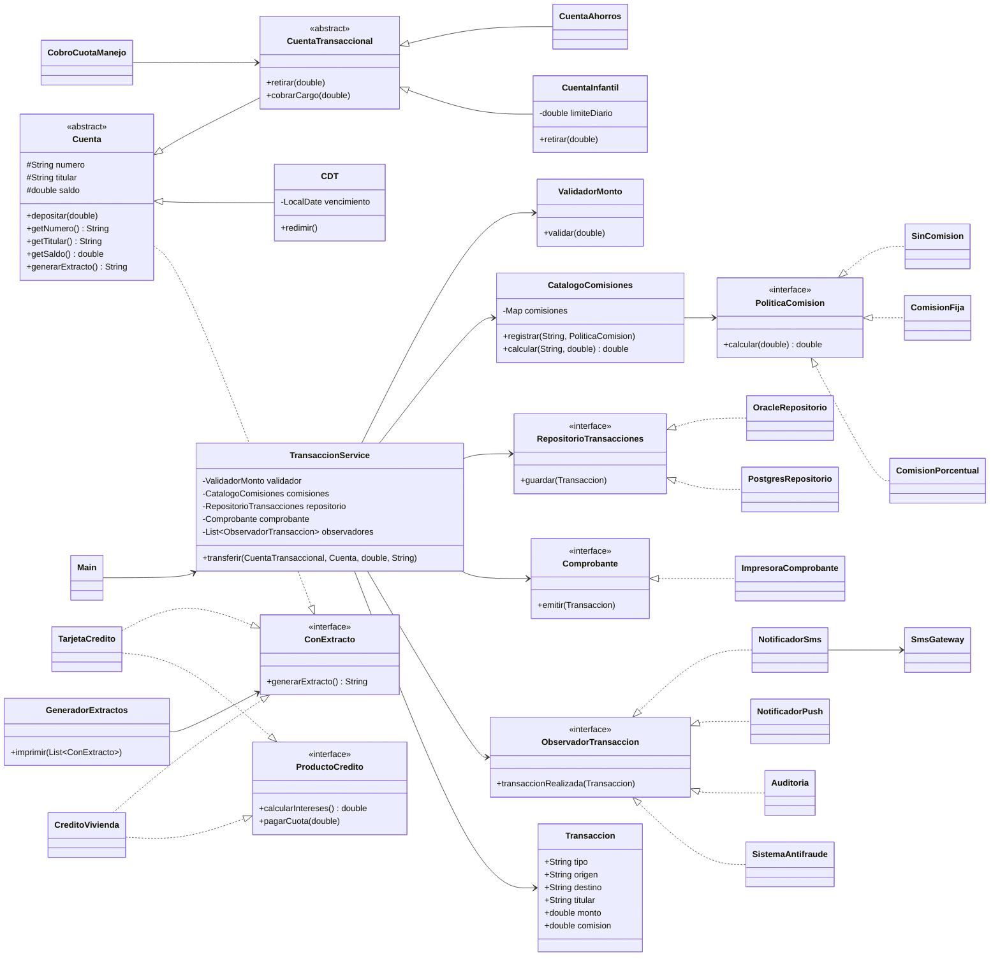

# Bloque 6 — Cierre

## 6.1 Diagrama de clases final

El diseño final separa las responsabilidades del sistema, elimina las dependencias directas de infraestructura dentro de `TransaccionService` y concentra el armado de la aplicación en `Main`.

### Interpretación del diseño final

- `TransaccionService` coordina una transferencia y no crea implementaciones concretas de infraestructura.
- Las comisiones se representan mediante `PoliticaComision` y `CatalogoComisiones`.
- La persistencia depende de `RepositorioTransacciones`, por lo que Oracle y PostgreSQL son intercambiables.
- Los efectos secundarios dependen de `ObservadorTransaccion`, permitiendo agregar SMS, push, auditoría, antifraude o correo sin modificar el servicio.
- `Comprobante` encapsula la generación del comprobante.
- `CuentaTransaccional` separa las cuentas que pueden retirar de las cuentas como `CDT`, que solamente pueden recibir o redimir fondos.
- `ConExtracto` permite generar extractos sin obligar a todos los productos a implementar operaciones que no necesitan.
- `Main` es la raíz de composición y decide las implementaciones concretas utilizadas por la aplicación.

## 6.2 Tabla comparativa

| Métrica | Antes | Después |
|---|---:|---:|
| Líneas del método `transferir` | 36 | 13 |
| Razones distintas por las que `TransaccionService` podría cambiar | 7 | 1 |
| Clases concretas que `TransaccionService` crea con `new` | 2 | 0 |
| Métodos vacíos o que lanzan excepción por “no aplica” | 4 | 0 |
| ¿Se puede probar `transferir` sin Oracle ni SMS? | No | Sí |
| Número total de archivos de producción | 11 | 31 |
| Archivos existentes modificados en total en el bloque 4 | — | 6 |

### Análisis de las métricas

El método `transferir` pasó de tener 36 líneas y siete responsabilidades diferentes a tener 13 líneas. Actualmente coordina la validación, el cálculo de la comisión, el movimiento del dinero, la persistencia, el comprobante y las notificaciones a través de clases y abstracciones especializadas.

Antes, `TransaccionService` podía cambiar por las reglas de validación, las tarifas, la forma de mover el dinero, la base de datos, el formato del comprobante, el canal de notificación y el formato de auditoría. Después de la refactorización, su responsabilidad principal es coordinar el flujo de una transferencia.

También se eliminaron los métodos vacíos que existían en `TarjetaCredito` y `CreditoVivienda`. La interfaz original obligaba a todos los productos a implementar operaciones que no les correspondían. Las interfaces finales representan capacidades específicas.

El número de archivos aumentó de 11 a 31 porque se separaron responsabilidades que antes estaban mezcladas. Este aumento es aceptable porque las clases tienen responsabilidades claras, pueden probarse de forma independiente y reducen el acoplamiento.

## 6.3 Respuestas de cierre

### a) El código final tiene muchos más archivos que el original. ¿Es eso un problema? ¿En qué situación sí lo sería?

No necesariamente. El aumento se debe a que se separaron responsabilidades que antes estaban concentradas en pocas clases. `TransaccionService` ya no valida, calcula tarifas, persiste, imprime, notifica y audita directamente.

El código tendría más archivos, pero también tiene clases más pequeñas, pruebas más simples y cambios más localizados. La cantidad de archivos sí sería un problema si existieran clases sin responsabilidad clara, interfaces innecesarias, duplicación de código o una estructura tan fragmentada que dificultara encontrar el comportamiento.

En este caso, el aumento está justificado porque cada clase representa una decisión concreta del diseño.

### b) ¿En qué requerimiento del bloque 4 se notó más la diferencia entre el código original y el refactorizado? ¿Por qué?

La diferencia se notó especialmente en R1, R3, R4 y R5:

- R1 agregó transferencias por llave mediante una nueva entrada en `Main`.
- R3 agregó notificaciones push mediante `NotificadorPush` y la lista de observadores.
- R4 agregó el sistema antifraude mediante `SistemaAntifraude`.
- R5 permitió cambiar Oracle por PostgreSQL mediante `PostgresRepositorio` y una modificación en `Main`.

En el código original todos estos cambios habrían afectado principalmente a `TransaccionService`, la clase que también movía el dinero. En el código refactorizado no fue necesario modificar esa clase.

R2, cuenta infantil, mostró una debilidad inicial del diseño. El límite diario de retiros también afectaba el cobro de la cuota. La solución fue separar `retirar`, que representa una acción del cliente, de `cobrarCargo`, que representa un cargo del banco.

### c) ¿Hubo algún requerimiento que su diseño no aguantó bien? ¿Qué cambiarían?

Sí. La primera versión de R2 no distinguía correctamente entre un retiro del cliente y un cargo interno del banco. Por eso una cuenta infantil podía impedir el cobro de la cuota cuando ya había alcanzado su límite diario.

Se solucionó agregando `cobrarCargo(double)` en `CuentaTransaccional` y haciendo que `CobroCuotaManejo` utilizara esa operación. El método se dejó como `final` para que las subclases no pudieran volver a restringirlo de forma incompatible.

También identificamos una mejora pendiente: si un observador lanza una excepción, los observadores siguientes podrían no ejecutarse. Esto es especialmente delicado si falla el SMS antes de la auditoría o del antifraude. En una versión futura separaríamos observadores críticos y no críticos, registraríamos los errores individualmente y usaríamos reintentos o una cola de eventos para los servicios externos.

### d) ¿Qué les dijo la otra pareja en la revisión cruzada? ¿Están de acuerdo?

La otra pareja indicó que las clases tenían nombres claros, que era posible reutilizar piezas sin copiar y pegar, que no había métodos vacíos ni operaciones “no aplica”, y que no era necesario modificar `TransaccionService` para agregar funcionalidades nuevas.

También agregaron una notificación por correo implementando `ObservadorTransaccion` y registrándola desde `Main`. Las pruebas existentes continuaron pasando.

Estamos de acuerdo. La lista de observadores permitió extender el sistema sin modificar el flujo central de transferencia. Esto confirma que la aplicación de OCP y DIP fue útil para un requerimiento que no conocíamos previamente.

**Lo mejor del diseño:** la composición en `Main` permite conectar nuevas piezas sin modificar `TransaccionService`. También son útiles las políticas de comisión, los observadores, las interfaces pequeñas y la separación entre cuentas transaccionales y productos con extracto.

**Lo que costó entender o extender:** la diferencia entre `Cuenta`, `CuentaTransaccional`, `ProductoCredito` y `ConExtracto`. También fue necesario analizar cuidadosamente la cuenta infantil para distinguir las reglas de retiro del cliente de los cargos realizados por el banco.

### e) Si tuvieran que convencer a su jefe de invertir dos semanas en refactorizar el backend real del banco, ¿qué argumento usarían?

La refactorización reduce el riesgo y el costo de los cambios futuros. En el diseño original, `TransaccionService` tenía 36 líneas, siete responsabilidades distintas, dependencias concretas de Oracle y SMS, un `switch` por tipo de transferencia y una jerarquía que permitía que un CDT llegara a una operación inválida.

En el diseño final:

- `transferir` quedó reducido a 13 líneas.
- `TransaccionService` crea cero dependencias concretas.
- Las pruebas se ejecutan sin Oracle ni SMS.
- Se pueden agregar nuevos observadores sin modificar la lógica central.
- Oracle puede cambiarse por PostgreSQL desde la composición.
- Las nuevas políticas de comisión se agregan mediante implementaciones independientes.
- El compilador evita pasar un CDT a operaciones que requieren una cuenta transaccional.
- Se eliminaron los métodos vacíos y las operaciones “no aplica”.

Aunque el número de archivos aumentó, los cambios quedaron más localizados. Durante el bloque 4, `TransaccionService` no tuvo que modificarse para transferencias por llave, notificaciones push, antifraude ni migración de base de datos.

Por lo tanto, invertir dos semanas en refactorizar no significa únicamente organizar el código: significa reducir regresiones, poder probar sin sistemas externos, detectar errores antes de producción y facilitar que otros desarrolladores modifiquen el backend con seguridad.

## 6.4 Conclusión general

La refactorización permitió comprobar que SOLID no consiste solamente en crear interfaces o dividir clases. Cada principio resolvió un problema concreto:

- **SRP:** separó las responsabilidades de `TransaccionService`.
- **OCP:** permitió agregar tipos de transferencia mediante políticas.
- **LSP:** evitó utilizar un CDT como si fuera una cuenta que permite retiros.
- **ISP:** eliminó métodos que no aplicaban a todos los productos.
- **DIP:** separó la lógica de negocio de Oracle, SMS y otras implementaciones concretas.

El resultado final tiene más clases, pero cada una representa una decisión específica. Esto hace que el sistema sea más fácil de probar y que los cambios de negocio tengan un impacto más controlado.

La principal lección es que una refactorización no debe evaluarse solamente por la cantidad de archivos o líneas de código. Debe evaluarse por la facilidad para comprender, probar, extender y modificar el sistema sin romper funcionalidades existentes.
