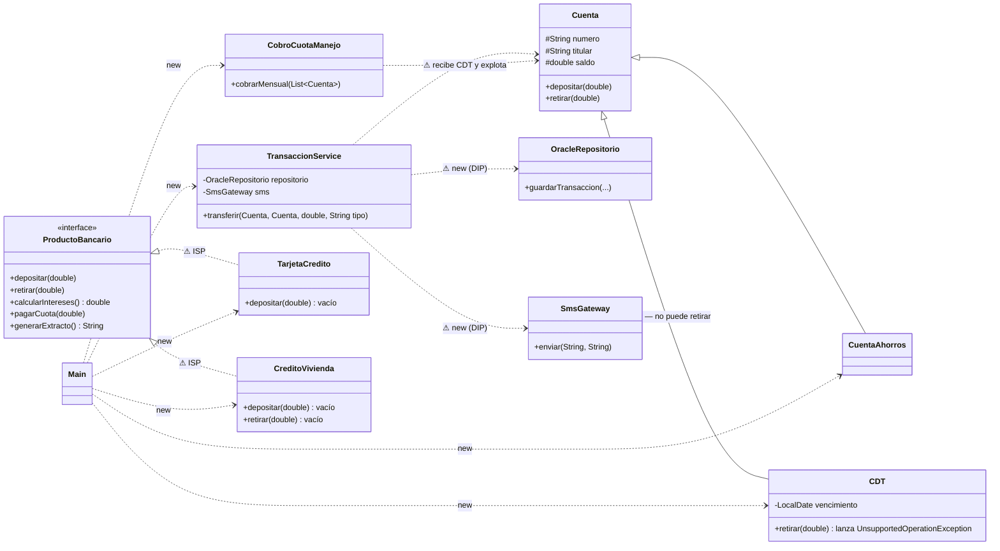

# Diagrama de clases — código original (bloque 1)

Las clases con borde rojo y las relaciones marcadas con ⚠ son las que consideramos problemáticas.

Notas:
- `TransaccionService` está en rojo porque concentra siete responsabilidades (SRP) y tiene el
  `switch` por tipo (OCP), además de crear sus dependencias (DIP).
- La herencia `Cuenta <|-- CDT` es la que rompe LSP.
- `Main` crea todo con `new`, pero eso no lo marcamos: que el programa principal arme el sistema
  está bien, lo malo es que `TransaccionService` también lo haga.
