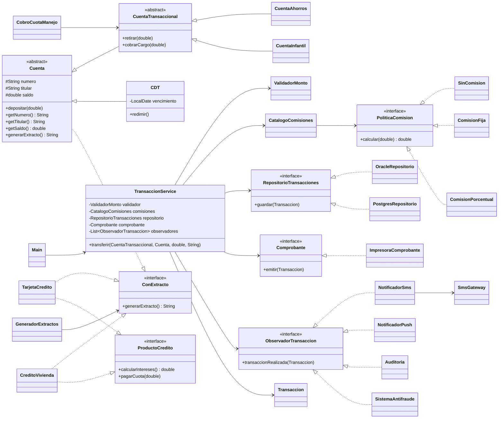

# Diagrama de clases — diseño final (bloque 6)

```mermaid
classDiagram
    direction LR

    class Cuenta {
        <<abstract>>
        #String numero
        #String titular
        #double saldo
        +depositar(double)
        +getNumero() String
        +getTitular() String
        +getSaldo() double
        +generarExtracto() String
    }
    class CuentaTransaccional {
        <<abstract>>
        +retirar(double)
        +cobrarCargo(double)
    }
    class CuentaAhorros
    class CuentaInfantil
    class CDT {
        -LocalDate vencimiento
        +redimir()
    }
    class TransaccionService {
        -ValidadorMonto validador
        -CatalogoComisiones comisiones
        -RepositorioTransacciones repositorio
        -Comprobante comprobante
        -List~ObservadorTransaccion~ observadores
        +transferir(CuentaTransaccional, Cuenta, double, String)
    }
    class Transaccion
    class ValidadorMonto
    class CatalogoComisiones
    class PoliticaComision {
        <<interface>>
        +calcular(double) double
    }
    class SinComision
    class ComisionFija
    class ComisionPorcentual
    class RepositorioTransacciones {
        <<interface>>
        +guardar(Transaccion)
    }
    class OracleRepositorio
    class PostgresRepositorio
    class Comprobante {
        <<interface>>
        +emitir(Transaccion)
    }
    class ImpresoraComprobante
    class ObservadorTransaccion {
        <<interface>>
        +transaccionRealizada(Transaccion)
    }
    class NotificadorSms
    class NotificadorPush
    class Auditoria
    class SistemaAntifraude
    class SmsGateway
    class ConExtracto {
        <<interface>>
        +generarExtracto() String
    }
    class GeneradorExtractos
    class ProductoCredito {
        <<interface>>
        +calcularIntereses() double
        +pagarCuota(double)
    }
    class TarjetaCredito
    class CreditoVivienda
    class CobroCuotaManejo
    class Main

    Cuenta <|-- CuentaTransaccional
    Cuenta <|-- CDT
    CuentaTransaccional <|-- CuentaAhorros
    CuentaTransaccional <|-- CuentaInfantil
    Cuenta ..|> ConExtracto
    TarjetaCredito ..|> ConExtracto
    CreditoVivienda ..|> ConExtracto
    TarjetaCredito ..|> ProductoCredito
    CreditoVivienda ..|> ProductoCredito
    PoliticaComision <|.. SinComision
    PoliticaComision <|.. ComisionFija
    PoliticaComision <|.. ComisionPorcentual
    RepositorioTransacciones <|.. OracleRepositorio
    RepositorioTransacciones <|.. PostgresRepositorio
    Comprobante <|.. ImpresoraComprobante
    ObservadorTransaccion <|.. NotificadorSms
    ObservadorTransaccion <|.. NotificadorPush
    ObservadorTransaccion <|.. Auditoria
    ObservadorTransaccion <|.. SistemaAntifraude
    NotificadorSms --> SmsGateway
    CatalogoComisiones --> PoliticaComision
    TransaccionService --> ValidadorMonto
    TransaccionService --> CatalogoComisiones
    TransaccionService --> RepositorioTransacciones
    TransaccionService --> Comprobante
    TransaccionService --> ObservadorTransaccion
    TransaccionService --> Transaccion
    GeneradorExtractos --> ConExtracto
    CobroCuotaManejo --> CuentaTransaccional
    Main --> TransaccionService
```
